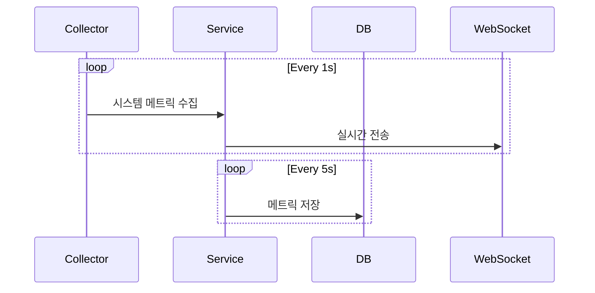
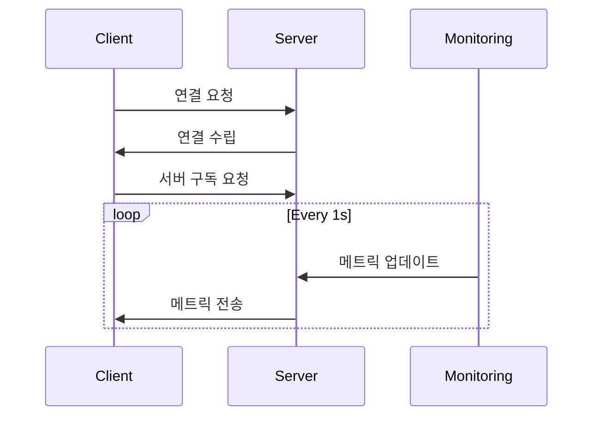

# Backend 아키텍처

## 핵심 컴포넌트

### API 서버 (actix-web)
```rust
HttpServer::new(move || {
    App::new()
        .wrap(Logger::default())
        .wrap(Compress::default())
        .wrap(setup_cors())
        .wrap(AuthMiddleware)
        .configure(configure_routes)
})
```

### 모니터링 시스템
```rust
pub struct MonitoringService {
    repo: Repository,
    collectors: Arc<RwLock<HashMap<String, Arc<MetricsCollector>>>>,
}
```

### WebSocket 서비스
```rust
pub struct WebSocketConnection {
    last_heartbeat: Instant,
    monitoring_service: MonitoringService,
    subscription_handles: Arc<Mutex<HashMap<String, SpawnHandle>>>,
    server_id: Option<String>,
}
```

## 주요 기능 구현

### 1. 메트릭 수집
- **수집 주기**: 1초
- **저장 주기**: 5초
- **수집 항목**:
  - CPU 사용률
  - 메모리 사용량
  - 디스크 사용량
  - 네트워크 트래픽
  - 프로세스 정보 (Top 10)

### 2. 실시간 통신
- WebSocket 연결 관리
- Heartbeat 메커니즘 (5초 간격)
- 자동 재연결 (연결 끊김 시 5초 후 재시도)

### 3. 인증 시스템
- JWT 기반 인증
- 토큰 갱신 메커니즘
- 권한 기반 접근 제어

## 데이터 흐름

1. **메트릭 수집 프로세스**


2. **WebSocket 통신 프로세스**


## 오류 처리

### 1. 연결 관리
```rust
fn _handleError(error: dynamic) {
    logger.error('WebSocket error: $error');
    _isConnected = false;
    _isConnecting = false;
    _scheduleReconnect();
}
```

### 2. 데이터베이스 오류
- 트랜잭션 기반 데이터 무결성 보장
- 재시도 메커니즘
- 에러 로깅

## 확장성 고려사항

1. **수평적 확장**
   - 상태 비저장 API 설계
   - 데이터베이스 파티셔닝

2. **수직적 확장**
   - 비동기 처리 최적화
   - 커넥션 풀링