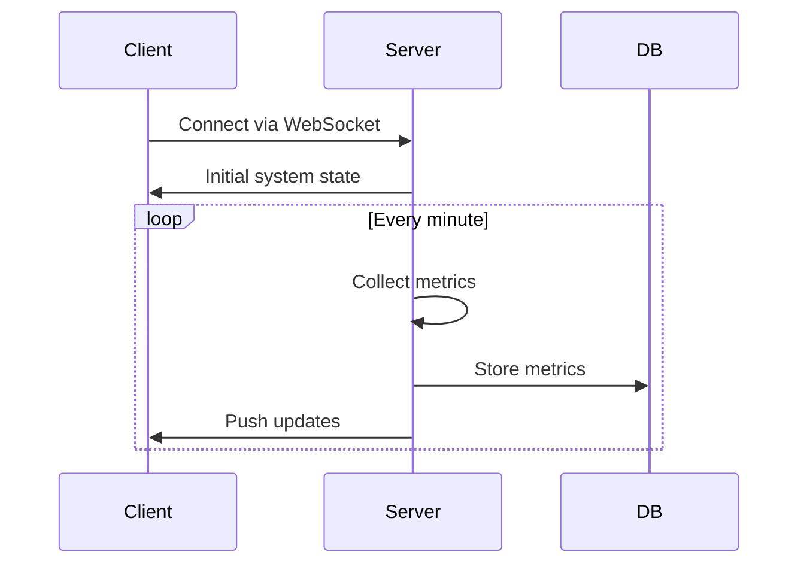
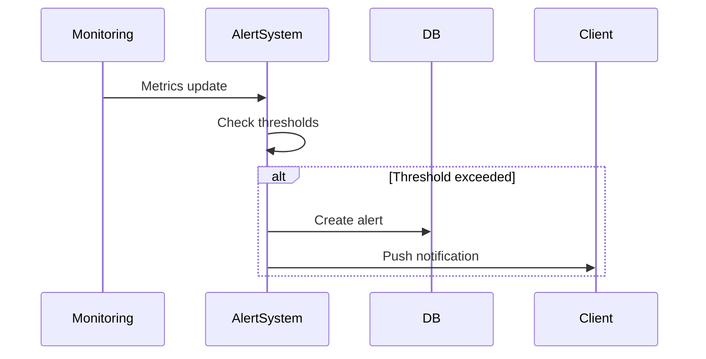

# System Architecture Overview

## System Components

### Backend Server (Rust)
- **Framework**: Actix-web 4.x
- **Database**: PostgreSQL 15+ with TimescaleDB
- **Features**:
  - Real-time server monitoring
  - WebSocket support for live updates
  - JWT authentication
  - RESTful API
  - Metrics collection and storage
  - Alert system

### Frontend Client (Flutter)
- **Framework**: Flutter 3.19+
- **State Management**: Provider
- **Features**:
  - Cross-platform support (iOS, Android, Web)
  - Real-time metrics visualization
  - Server management interface
  - Alert notifications
  - Responsive design

### Database
- **PostgreSQL + TimescaleDB**
- **Data Models**:
  ```
  servers
  ├── id (UUID)
  ├── name
  ├── hostname
  ├── ip_address
  └── status

  metrics_snapshots
  ├── id
  ├── server_id
  ├── timestamp
  ├── cpu_usage
  ├── memory_usage
  └── disk_usage

  alerts
  ├── id
  ├── server_id
  ├── type
  ├── severity
  └── timestamp
  ```

## System Flow

### 1. Monitoring Flow


### 2. Alert System


## Security Architecture

### Authentication
- JWT-based authentication
- Token expiration and refresh mechanism
- Role-based access control

### Data Security
- TLS/SSL encryption
- Database connection pooling
- Prepared statements for SQL injection prevention

## Scalability Considerations

### Backend Scalability
- Stateless API design
- Database connection pooling
- Efficient WebSocket connection management

### Data Management
- TimescaleDB for efficient time-series data
- Automatic data retention policies
- Metrics aggregation for historical data

## Development Architecture

### Backend Structure
```
rust_server/
├── src/
│   ├── api/        # REST endpoints
│   ├── auth/       # Authentication
│   ├── db/         # Database operations
│   ├── monitoring/ # System monitoring
│   └── websocket/  # Real-time updates
```

### Frontend Structure
```
flutter_client/
├── lib/
│   ├── core/
│   │   ├── auth/
│   │   ├── config/
│   │   └── network/
│   ├── features/
│   │   ├── dashboard/
│   │   ├── monitoring/
│   │   └── settings/
│   └── shared/
      ├── widgets/
      └── utils/
```

## Technology Stack Details

### Backend Technologies
- **Rust** - Systems programming language
- **Actix-web** - Web framework
- **SQLx** - Database toolkit
- **Serde** - Serialization framework
- **Tokio** - Async runtime
- **WebSocket** - Real-time communication

### Frontend Technologies
- **Flutter** - UI framework
- **Provider** - State management
- **dio** - HTTP client
- **web_socket_channel** - WebSocket client
- **charts_flutter** - Data visualization
- **flutter_secure_storage** - Secure storage

### Development Tools
- **Docker** - Containerization
- **GitHub Actions** - CI/CD
- **SQLx-cli** - Database migrations
- **flutter_test** - Testing framework

## Performance Considerations

### Backend Optimization
- Connection pooling
- Async I/O operations
- Efficient data serialization
- WebSocket connection management

### Frontend Optimization
- Lazy loading
- Efficient state management
- Widget rebuilding optimization
- Asset optimization

## Deployment Architecture

### Production Environment
- **Backend**: Docker containers
- **Database**: Managed PostgreSQL service
- **Frontend**: Web servers/Mobile app stores

### Development Environment
- Local development setup
- Docker Compose for services
- Hot reloading support

## Monitoring and Logging

### System Monitoring
- Performance metrics collection
- Resource usage tracking
- Error rate monitoring
- API latency tracking

### Logging
- Structured logging
- Log levels configuration
- Trace ID for request tracking

## Future Considerations

### Planned Improvements
- Kubernetes deployment support
- GraphQL API implementation
- Real-time analytics
- Enhanced security features

### Scalability Plans
- Microservices architecture
- Distributed monitoring
- Load balancing implementation