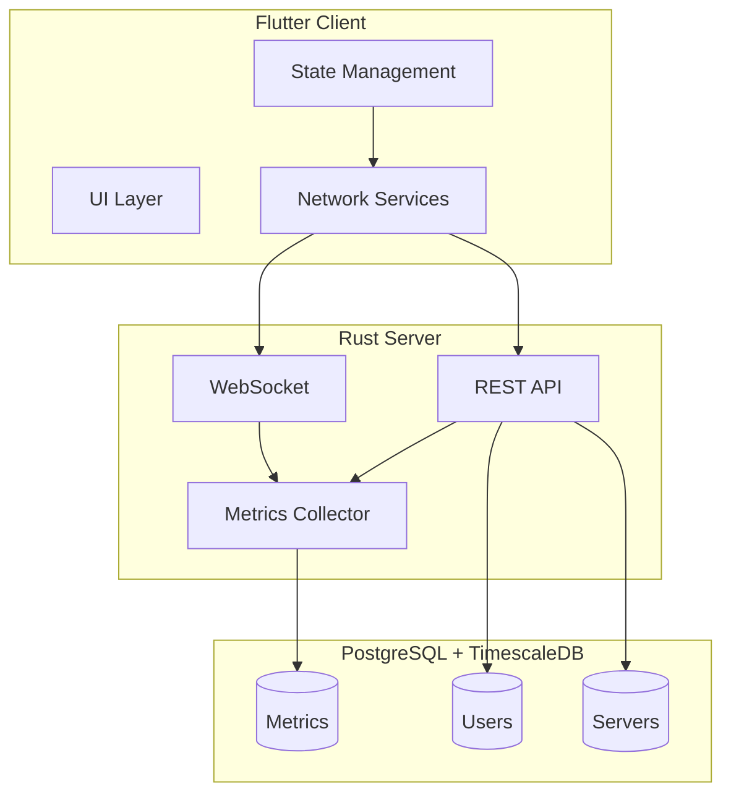

# FLick - 시스템 아키텍처 개요

## 시스템 구조

## 주요 컴포넌트

### 클라이언트 (Flutter)
- **UI Layer**: Material Design 3 기반 사용자 인터페이스
- **State Management**: Provider 패턴을 사용한 상태 관리
- **Network Services**: 
  - WebSocket을 통한 실시간 메트릭 수신
  - REST API를 통한 서버 관리

### 서버 (Rust)
- **REST API**: Actix-web 기반 HTTP 엔드포인트
- **WebSocket Server**: 실시간 메트릭 스트리밍
- **Metrics Collector**: sysinfo 기반 시스템 메트릭 수집
- **Authentication**: JWT 기반 인증 시스템

### 데이터베이스
- **PostgreSQL**: 기본 데이터 저장소
- **TimescaleDB**: 시계열 메트릭 데이터 최적화

## 데이터 흐름

1. **메트릭 수집**
   - Metrics Collector가 1초 간격으로 시스템 메트릭 수집
   - 수집된 데이터는 5초 간격으로 TimescaleDB에 저장

2. **실시간 모니터링**
   - 클라이언트는 WebSocket을 통해 서버에 연결
   - 서버는 수집된 메트릭을 실시간으로 스트리밍

3. **서버 관리**
   - 클라이언트는 REST API를 통해 서버 추가/제거/관리
   - 모든 API 요청은 JWT 토큰으로 인증

## 보안 아키텍처

1. **인증 시스템**
   - JWT 기반 접근 제어
   - 비밀번호 Argon2 해싱
   - AES-GCM 기반 서버 인증정보 암호화

2. **네트워크 보안**
   - HTTPS/WSS 통신
   - CORS 설정
   - Rate Limiting