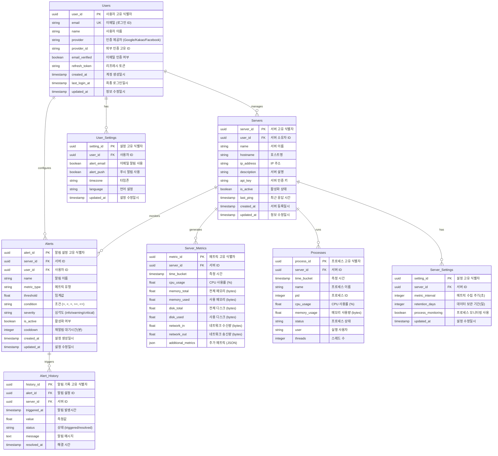

# FLick - 서버 모니터링 시스템 설계

## Database Design Documentation

This document outlines the database structure for the FLick Server Monitoring System.

## Entity Relationship Diagram (ERD)



## Database Design Features

### TimescaleDB Integration

- Server_Metrics and Processes tables are implemented as TimescaleDB hypertables
- Automatic partitioning by time for efficient time-series data management
- Configurable retention policy through retention_days setting

### Key Design Considerations

#### Security

- API key authentication for server monitoring
- OAuth provider integration with separate provider IDs
- Email verification system
- Refresh token management

#### Scalability

- UUID usage for distributed systems compatibility
- JSON support for extensible metrics
- Separated settings tables for flexible configuration
- TimescaleDB partitioning for high-volume data

#### Monitoring Features

- Comprehensive server metrics tracking
- Detailed process monitoring
- Flexible alert system with severity levels
- Customizable metric collection intervals

#### User Experience

- Multiple authentication providers
- Timezone and language preferences
- Configurable alert notifications
- Alert cooldown prevention

## Implementation Notes

```sql
-- Enable TimescaleDB extension
CREATE EXTENSION IF NOT EXISTS timescaledb;

-- Create hypertables for time-series data
SELECT create_hypertable('server_metrics', 'time_bucket');
SELECT create_hypertable('processes', 'time_bucket');

-- Set up retention policy
SELECT add_retention_policy('server_metrics', INTERVAL '1 day' * :retention_days);
SELECT add_retention_policy('processes', INTERVAL '1 day' * :retention_days);
```